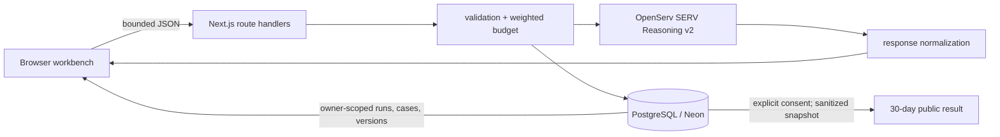

# Architecture

The browser never receives credentials. `lib/serv.ts` is the provider adapter: it uses a forced function tool, validates the selected enum, preserves actual JSON for the owner, and invents no probability or trace.

Anonymous ownership is a random HttpOnly, Secure-in-production, SameSite=Strict cookie; only its hash is stored. Nodes own versions; runs store exact inputs and results; cases reference measured run IDs. Saving reloads that pair, so later draft edits cannot alter evidence. Public results are separate, consent-gated, sanitized records.

Tested text is untrusted prompt data. Requests/responses and provider timeouts are bounded. Errors are sanitized. Weighted public limits protect inference spend.
