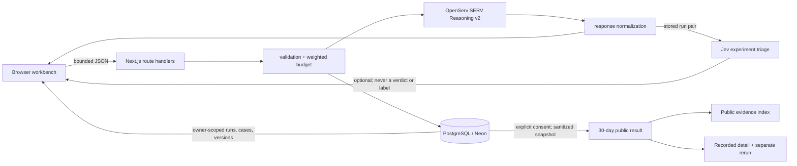

# Architecture

The browser never receives credentials. `lib/serv.ts` is the provider adapter: it uses a forced function tool, validates the selected enum, preserves actual JSON for the owner, and invents no probability or trace. `lib/jev.ts` is an independent, optional adapter for experiment triage. It reports documented Choice outputs for apparent edit relevance and review priority; the observed hold/flip is derived from the two actual SERV answers. Jev cannot select the decision answer, label or save a case, or enter a candidate-generation prompt.

Anonymous ownership is a random HttpOnly, Secure-in-production, SameSite=Strict cookie; only its hash is stored. Nodes own versions; runs store exact inputs and results; cases reference measured run IDs. Saving reloads that pair, so later draft edits cannot alter evidence. Jev analyses are stored against that exact run pair. Public results are separate, consent-gated, sanitized records; held-out cases are rejected from publication. The public index reads only complete, versioned, unexpired publication snapshots and never queries private workspace rows.

`GET /api/health` distinguishes configuration from a live database/schema probe without returning credentials. Tested text is untrusted prompt data. Requests/responses and provider timeouts are bounded. Errors are sanitized. Weighted public limits protect inference spend.
